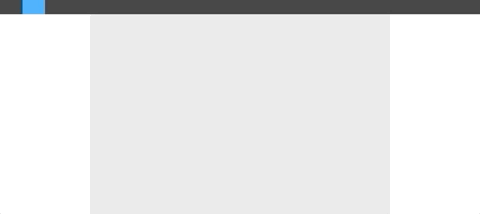

A collaborative drawing app using socket.io, node.js and react. 

Front-End
- navigate to the frontend folder and run `npm run start`

Backend 
- navigate to the backend folder and run `node app.js`

